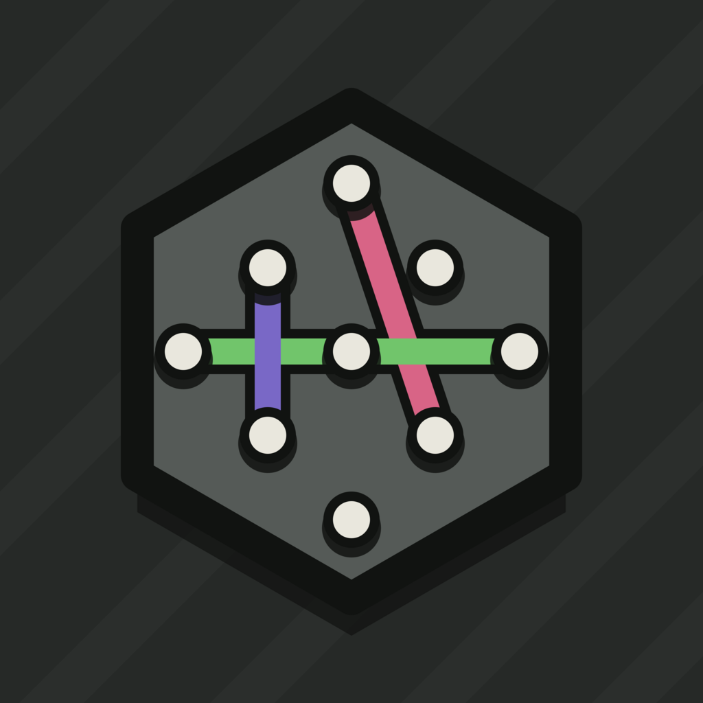

# TriGrid

<p align="center">
  
</p>

TriGrid is an original, tactile strategy game for Android and iOS. Players
stretch bands across a triangular peg lattice and capture unit triangles by
completing their boundaries. The working title, interface, artwork, audio, and
implementation are original.

## Current status

Milestones 1–8 are implemented and pass the automated Windows/loopback quality
gate. Local
matches support two to four humans or bots on independently selected board
sizes, including private pass-and-play turn handoffs. Tap or drag to place
bands, pinch/pan the camera, use the compact score HUD, pause safely, request a
legal hint, and restart or replay a finished match. The deterministic engine
remains the authority for every move.

Placement now has elastic tension, snapping, overshoot, invalid return, and peg
compression. Captures animate edge-to-center with marker drops, particles,
score count-up, optional shake, original sound, and differentiated haptics.
Turn lighting, inertial camera motion, victory framing, winner pulse, confetti,
and deterministic match replay complete the local game-feel pass. The pause
surface exposes music, effects, ambience, mute, haptics, reduced motion,
particles, shake, and animation speed.

Beginner, Easy, Normal, Hard, and Expert bots run outside the UI isolate. Local
setup supports mixed seats, three strategic personalities, configurable
thinking time, and a debug bot-vs-bot shortcut. Two-player search uses
alpha-beta; multiplayer search uses MaxN. See [Bot AI](docs/BOT_AI.md).

LAN matches use a real authoritative WebSocket host with native
DNS-SD/Bonjour discovery, UDP broadcast fallback, manual IP, and versioned QR
joining. The lobby includes ready/color/bot controls; gameplay includes
confirmed move animation, sequence/idempotency checks, heartbeats, hashes,
snapshots, persistent reconnect tokens, disconnect pause, and host
wait/remove/replace decisions. See [LAN protocol](docs/LAN_PROTOCOL.md).
Physical Android/iOS same-Wi-Fi and hotspot validation remains a release-device
gate.

Settings, English/Kazakh/Russian localization, tutorial/rules, local and LAN
statistics, resumable local matches, verified replay playback, and archived
last-valid LAN positions are included. Large, Huge, and radius-8 Custom boards
have an automated performance gate. Debug builds provide a toggleable
FPS/frame/search/network/revision/hash panel.

- [Canonical rules](docs/RULES.md)
- [Technical architecture](docs/ARCHITECTURE.md)
- [Bot AI](docs/BOT_AI.md)
- [LAN protocol](docs/LAN_PROTOCOL.md)
- [Performance record](docs/PERFORMANCE.md)
- [Implementation checklist](docs/IMPLEMENTATION_CHECKLIST.md)
- [Acceptance audit](docs/ACCEPTANCE_AUDIT.md)
- [Asset licenses](ASSET_LICENSES.md)

## Requirements

- Flutter 3.41.4 stable or a compatible newer stable release
- Dart 3.11.1 or the Dart version bundled with Flutter
- Android Studio with an Android SDK for Android builds
- Xcode and CocoaPods on macOS for iOS builds

## Set up and run

```sh
flutter pub get
flutter run
```

Choose a target explicitly when more than one device is connected:

```sh
flutter devices
flutter run -d <device-id>
```

## Generate, check, and test

```sh
flutter gen-l10n
dart run build_runner build --delete-conflicting-outputs
dart format .
flutter analyze
flutter test
dart run tool/performance_benchmark.dart
```

The original placeholder WAV pack is reproducible:

```sh
dart run tool/generate_placeholder_audio.dart
```

Run the physical Android acceptance harness with the phone unlocked and kept
in the foreground:

```sh
TRIGRID_ACCEPTANCE_BUILD_ID="$(dart tool/acceptance_build_id.dart)"

flutter drive --driver=test_driver/integration_test.dart \
  --target=integration_test/device_acceptance_test.dart \
  -d <android-device-id> --profile --no-dds \
  --dart-define=TRIGRID_DEVICE_TEST_SCOPE=functional \
  --dart-define=TRIGRID_DEVICE_LABEL=<device-label> \
  --dart-define=TRIGRID_ACCEPTANCE_BUILD_ID="$TRIGRID_ACCEPTANCE_BUILD_ID"

flutter drive --driver=test_driver/integration_test.dart \
  --target=integration_test/device_acceptance_test.dart \
  -d <android-device-id> --profile --no-dds \
  --dart-define=TRIGRID_DEVICE_TEST_SCOPE=performance \
  --dart-define=TRIGRID_PROFILE_CASE=all \
  --dart-define=TRIGRID_DEVICE_LABEL=<device-label> \
  --dart-define=TRIGRID_ACCEPTANCE_BUILD_ID="$TRIGRID_ACCEPTANCE_BUILD_ID"
```

In PowerShell, set
`$trigridAcceptanceBuildId = dart tool/acceptance_build_id.dart` and pass
`--dart-define=TRIGRID_ACCEPTANCE_BUILD_ID=$trigridAcceptanceBuildId` to both
commands. Recompute the ID whenever production, platform, dependency, or
acceptance-harness inputs change; do not reuse evidence from an earlier ID.

The functional run checks native DNS-SD/Bonjour and a real menu-to-game flow.
The full performance run measures capture-heavy Large, Huge, and radius-8
gameplay with particles/screen shake both enabled and disabled. Every case
exercises zoom, pan, and reset against the 16.67 ms build-and-raster p90 budget.
Every run first records a target-identity entry from the platform plugin, and
each evidence entry includes the same machine-reported physical-device flag,
manufacturer/model, and OS version. Emulator and simulator runs remain useful
negative controls but cannot pass the acceptance verifier.
Set `TRIGRID_PROFILE_CASE` to one of `large_effects_on`,
`large_effects_off`, `huge_effects_on`, `huge_effects_off`,
`radius8_effects_on`, or `radius8_effects_off` for an isolated rerun. Use a
filesystem-safe device label such as `android_pixel_7`. Merged JSON and
screenshots are written under `build/device-acceptance/`.

After both runs succeed, verify that the report contains complete,
non-contradictory evidence for the device:

```sh
dart run tool/verify_device_acceptance.dart \
  --device=<device-label>
```

Repeat `--device` for every Android/iOS device being accepted. The verifier
requires native discovery, the local-game handoff screenshots, and all six
passing profile cases; virtual-device, missing, debug-mode, undersampled,
over-budget, contradictory, or stale-build results fail with a nonzero exit
code. It independently recomputes the current acceptance build ID and requires
the identity, functional, screenshot, and performance evidence to match.

For a hardware handoff, create a build-bound acceptance kit:

```sh
dart tool/create_physical_acceptance_kit.dart
dart tool/create_physical_acceptance_kit.dart \
  --verify=build/physical-acceptance-kit/<acceptance-build-id>
```

The kit contains the exact Android debug APK, a fresh nine-scenario LAN
template, a cross-platform physical runbook, and a manifest with SHA-256
checksums. Its default directory is named with the current acceptance build ID,
and the generator refuses to overwrite an existing kit. The integrity check
also rejects a kit from a different current source state. A kit organizes the
handoff; it does not replace physical-device, profile, LAN, or Xcode evidence.

JSON generation is included for the serializable game and protocol models added
in later milestones. The build-runner command is safe when no generated models
exist yet.

## Engine

Import the public pure-Dart surface from:

```dart
import 'package:trigrid/core/game/trigrid_engine.dart';
```

Create `GameSettings`, construct `GameEngine(settings)`, obtain the initial
state, and submit `SubmitMoveAction` objects. Local play, bots, LAN authority,
and replay all use the same `MoveValidator` and reducer.

## Local controls

- Tap a starting peg, then a highlighted ending peg.
- Or drag from a valid starting peg to a highlighted ending peg.
- Drag from empty board space to pan.
- Pinch to zoom.
- Double-tap the board or use the toolbar target button to reset the camera.
- Use the lightbulb button to highlight one legal move.
- Open Pause to tune audio, haptics, particles, shake, and motion.
- Use Replay on the result card to re-run the exact accepted action log.
- In debug builds, use the bug icon to toggle live diagnostics.

## Android

```sh
flutter build apk --debug
```

The debug APK is written under `build/app/outputs/flutter-apk/`. The manifest
already declares internet, network-state, multicast, nearby Wi-Fi, and camera
permissions used by LAN discovery and QR join flows. TriGrid currently targets
Android API 36 and requests nearby-Wi-Fi access on entry to LAN mode when the
platform requires it. Revisit `ACCESS_LOCAL_NETWORK` and its runtime request
before raising `targetSdk` to 37 or later. Release signing and a final
application ID must be configured before store delivery.

## iOS

iOS builds require macOS:

```sh
cd ios
pod install
cd ..
flutter build ios --debug --no-codesign
```

`Info.plist` contains local-network, `_trigrid._tcp` Bonjour, and camera usage
descriptions. Native Bonjour is the primary automatic-discovery path on iOS,
so the restricted multicast entitlement is not required for discovery. A
developer team, final bundle identifier, signing profile, and physical-device
LAN validation are required before release.

## LAN play and device testing

LAN needs no internet service. Put all devices on the same Wi-Fi network, or
connect the clients to one phone's hotspot:

1. On the host, choose **Local network → Create a game**, enter the room
   details, and keep the lobby open.
2. On each client, choose **Local network → Join a game**. Select the discovered
   room, scan the host QR code, or enter the displayed host IP and room code.
3. Choose an available color/shape, mark each client ready, configure any bots
   and rules on the host, then start.
4. To test recovery, background or disconnect one client. The match pauses;
   reconnect from the saved-seat card, or let the host wait, remove that player,
   or replace them with a bot.

Automatic discovery advertises `_trigrid._tcp` through native DNS-SD/Bonjour
and also uses UDP broadcast port `42421` where raw broadcast is available.
Gameplay always uses WebSocket port `42422`; players never enter a port. Some
guest/enterprise networks enable client isolation and block device-to-device
traffic. In that case use a private Wi-Fi network or phone hotspot; manual IP
cannot bypass router isolation.

For cross-platform release testing, install the app on at least two physical
devices and cover Android↔Android, Android↔iOS, and iOS↔iOS on both same-Wi-Fi
and hotspot paths. Grant iOS Local Network access and Android nearby
device/network permissions if the OS prompts. The full matrix and wire schema
are in [docs/LAN_PROTOCOL.md](docs/LAN_PROTOCOL.md).

After recording all physical LAN scenarios in the shared device-acceptance
report, run the strict matrix gate:

```sh
dart tool/create_lan_device_matrix_template.dart
dart tool/inspect_lan_device_matrix_progress.dart --verbose
dart run tool/verify_lan_device_matrix.dart
```

The first command writes a current-build, nine-entry template at
`build/device-acceptance/lan_device_matrix.template.json` and refuses to
overwrite it unless `--force` is supplied. Fill a copy only from the stated
physical runs, then merge its completed entries into
`device_acceptance.json`. The generated placeholders intentionally fail the
strict verifier. The progress command reports each independently complete
scenario while evidence is collected; add `--json` for machine-readable
output or `--report=<path>` to inspect the merged acceptance report.

After the completed working matrix passes, merge it without modifying the
original acceptance report:

```sh
dart tool/merge_lan_device_matrix.dart \
  --source=<completed-lan-report> \
  --target=build/device-acceptance/device_acceptance.json \
  --output=build/device-acceptance/device_acceptance.with_lan.json

dart run tool/verify_lan_device_matrix.dart \
  --report=build/device-acceptance/device_acceptance.with_lan.json
```

The merge command independently requires a complete current-build matrix,
refuses an existing output file, and refuses to replace LAN entries already in
the target unless `--replace-existing` is explicitly supplied.

It requires eight same-Wi-Fi/hotspot full-match scenarios and the
client-isolation failure scenario, including two distinct machine-reported
physical devices, matching terminal hashes, reconnect/resync behavior, offline
operation, join-path coverage, and screenshots.

## Repository notes

This directory was created without Git metadata. Initialize version control
before collaborative development if change history is desired:

```sh
git init
git add .
git commit -m "Establish TriGrid foundation"
```

Do not add media whose licensing is unknown. Record every shipped asset in
`ASSET_LICENSES.md`.
